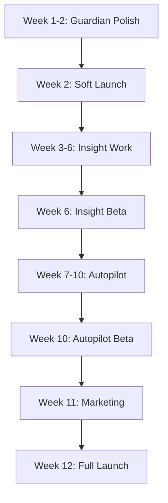

# 🎯 ODAVL Studio - Complete Launch Action Plan

**Target:** 100% Launch Readiness for All 3 Products  
**Timeline:** 90 Days (December 2, 2025 - March 2, 2026)  
**Current Progress:** 45% Complete

---

## 📅 Timeline Overview

```
Week 1-2: Guardian Polish & Soft Launch
Week 3-6: Insight Deep Work (Bundle, Tests, AI)
Week 7-10: Autopilot Enhancement (Recipes, Tests)
Week 11-12: Marketing & Final Launch
```

---

## Phase 1: Guardian Final Polish (Weeks 1-2) ✅ 80% DONE

### Week 1: Polish & Assets

#### Day 1-2: Screenshots & Visuals
```bash
# Task: Create 10 real screenshots
Scenarios:
1. Homepage test results (desktop)
2. Dashboard view with metrics
3. CLI test execution (terminal)
4. VS Code extension in action
5. HTML report output
6. Error detection example
7. AI analysis comparison
8. Mobile responsive test
9. Performance metrics
10. Security scan results

Tools:
- Use Playwright for automated screenshots
- Figma for mockups (if needed)
- Carbon.sh for code screenshots
```

**Deliverables:**
- [ ] 10 PNG screenshots (1920x1080)
- [ ] 5 Mobile screenshots (375x667)
- [ ] 3 Animated GIFs (key features)
- [ ] 1 Hero image for landing page

#### Day 3: Demo Video
```bash
# Task: Record 5-minute Guardian demo

Script:
1. Introduction (30s)
   - "Guardian tests your app before launch"
2. Installation (30s)
   - "npm install -g guardian-cli"
3. Quick Test (1min)
   - Show: guardian quick
4. AI Analysis (1min 30s)
   - Show: guardian ai with screenshots
5. Dashboard (1min)
   - Show: Web UI with results
6. CI/CD Integration (30s)
   - Show: GitHub Actions yaml
7. Call to Action (30s)
   - "Try Guardian today"

Tools:
- OBS Studio for recording
- DaVinci Resolve for editing
- Descript for captions
```

**Deliverables:**
- [ ] 5-min YouTube video
- [ ] 60s Twitter teaser
- [ ] 30s ProductHunt video

#### Day 4-5: Documentation Polish
```bash
# Task: Finalize all Guardian docs

Files to create/update:
1. README.md - Quick start + features
2. CONTRIBUTING.md - How to contribute
3. CHANGELOG.md - Version history
4. API.md - API documentation
5. EXAMPLES.md - Code examples
6. FAQ.md - Common questions
7. PRICING.md - Clear pricing tiers

Content requirements:
- Professional tone
- Code examples that work
- Clear screenshots
- Links to videos
```

**Deliverables:**
- [ ] 7 documentation files
- [ ] All code examples tested
- [ ] Links verified

### Week 2: Launch Preparation

#### Day 6-7: Pricing Page & Website
```html
<!-- Task: Create Guardian landing page -->

Sections:
1. Hero
   - "Test Before Launch - Every Time"
   - Guardian screenshot
   - CTA: "Try Free" + "Watch Demo"

2. Features (3 columns)
   - Zero-config testing
   - AI-powered analysis
   - CI/CD integration

3. Pricing (3 tiers)
   - Free: 50 tests/month
   - Pro: $49/month - Unlimited
   - Team: $149/month - 5 users

4. Social Proof
   - "Used by 100+ teams"
   - Testimonials (create 3)

5. Footer
   - Links, socials, contact
```

**Deliverables:**
- [ ] Landing page (HTML/React)
- [ ] Pricing calculator
- [ ] Contact form

#### Day 8-9: Support Setup
```bash
# Task: Setup support channels

1. Discord Server
   - Create server
   - Setup channels:
     #announcements
     #general
     #help
     #feedback
     #showcase

2. Email Support
   - Create support@odavl.dev
   - Setup auto-responder
   - Create support templates

3. GitHub Issues
   - Create issue templates
   - Setup labels
   - Pin FAQ issue
```

**Deliverables:**
- [ ] Discord server live
- [ ] Email configured
- [ ] Issue templates created

#### Day 10: ProductHunt Launch
```markdown
# Task: Launch on ProductHunt

Preparation:
1. Create ProductHunt account (if needed)
2. Gather 5 "hunters" to upvote
3. Prepare launch post:
   - Title: "Guardian - Test Your App Before Launch"
   - Tagline: "AI-powered pre-deploy testing with zero config"
   - Description: 500 words
   - Gallery: 5 screenshots + 1 video
   - First comment: Founder story

Launch Day Plan:
- 12:01am PST: Submit product
- 8am: Reply to all comments
- 12pm: Share on Twitter
- 4pm: Share on LinkedIn
- 8pm: Final push
```

**Deliverables:**
- [ ] ProductHunt page live
- [ ] 50+ upvotes (goal)
- [ ] 20+ comments responded

---

## Phase 2: Insight Deep Work (Weeks 3-6) ⏳ 50% DONE

### Week 3: Bundle Size Optimization

#### Task 1: Analyze Bundle
```bash
# Current: detector/index.mjs = 10.1 MB (!!)

Analysis steps:
1. Run bundle analyzer
   $ pnpm build --analyze

2. Identify large dependencies
   - TypeScript compiler API (~4 MB)
   - TensorFlow.js (~3 MB)
   - AST parsers (~2 MB)

3. Find unused code
   $ pnpm depcheck

Goal: 10 MB → 3 MB (70% reduction)
```

#### Task 2: Code Splitting
```typescript
// OLD: Everything in one bundle
export * from './detectors/...';

// NEW: Lazy loading
export async function loadDetector(name: string) {
  switch (name) {
    case 'typescript':
      return await import('./detectors/typescript-detector.js');
    case 'security':
      return await import('./detectors/security-detector.js');
    // ... etc
  }
}
```

#### Task 3: Tree Shaking
```json
// package.json
{
  "sideEffects": false,
  "exports": {
    ".": {
      "import": "./dist/index.mjs",
      "require": "./dist/index.js"
    },
    "./detector/typescript": {
      "import": "./dist/detector/typescript.mjs"
    }
    // Individual detector exports
  }
}
```

**Deliverables:**
- [ ] Bundle size < 3 MB
- [ ] Lazy loading implemented
- [ ] Tree shaking working

### Week 4: AI SDK Consolidation

#### Current State
```json
{
  "dependencies": {
    "@anthropic-ai/sdk": "^0.71.0",     // 5 MB
    "openai": "^6.9.1",                 // 3 MB
    "@tensorflow/tfjs-node": "^4.22.0"  // 100 MB (!!)
  }
}
```

#### Target State
```json
{
  "dependencies": {
    "@anthropic-ai/sdk": "^0.71.0"      // Keep this (best for code)
    // Remove openai (redundant)
    // Make TensorFlow optional
  },
  "optionalDependencies": {
    "@tensorflow/tfjs-node": "^4.22.0"  // Only for ML training
  }
}
```

#### Migration Plan
```typescript
// Create unified AI service
class InsightAIService {
  private anthropic: Anthropic;
  
  async analyzeCode(code: string) {
    // Use Anthropic for all AI features
    // Remove OpenAI dependency
  }
  
  async trainModel(data: Dataset) {
    // Only load TensorFlow if available
    try {
      const tf = await import('@tensorflow/tfjs-node');
      return tf.train(data);
    } catch {
      console.warn('TensorFlow not available - skipping ML training');
      return null;
    }
  }
}
```

**Deliverables:**
- [ ] Single AI SDK (Anthropic)
- [ ] TensorFlow optional
- [ ] All features still working

### Week 5: Test Coverage Improvement

#### Current: 3.6% Coverage ❌
#### Target: 60% Coverage ✅

**Strategy:**
1. **Phase 1:** Core detectors (20%)
   ```typescript
   // Test each detector independently
   describe('TypeScriptDetector', () => {
     it('detects unused variables', async () => {
       const code = `const unused = 42;`;
       const result = await detector.analyze(code);
       expect(result.issues).toHaveLength(1);
     });
   });
   ```

2. **Phase 2:** Integration tests (20%)
   ```typescript
   // Test detector combinations
   describe('Multi-detector analysis', () => {
     it('runs all 12 detectors', async () => {
       const result = await analyzeWorkspace('./fixtures/sample-project');
       expect(result.detectors.length).toBe(12);
     });
   });
   ```

3. **Phase 3:** ML training (10%)
   ```typescript
   // Test ML training pipeline
   describe('ML Training', () => {
     it('trains trust predictor', async () => {
       const model = await trainTrustModel(mockData);
       expect(model.accuracy).toBeGreaterThan(0.8);
     });
   });
   ```

4. **Phase 4:** VS Code extension (10%)
   ```typescript
   // Test extension activation
   describe('Extension', () => {
     it('activates on workspace open', async () => {
       await vscode.extensions.getExtension('odavl.insight').activate();
       expect(extension.isActive).toBe(true);
     });
   });
   ```

**Deliverables:**
- [ ] 60% test coverage
- [ ] All 13 failing tests fixed
- [ ] CI passing

### Week 6: VS Code Extension Polish

#### Improvements Needed
1. **Startup Performance**
   ```typescript
   // OLD: Load everything at startup (slow)
   import { all12Detectors } from '@odavl-studio/insight-core';
   
   // NEW: Lazy load (fast)
   async function runAnalysis() {
     const detector = await loadDetector('typescript');
     return detector.analyze();
   }
   ```

2. **Better UI**
   ```typescript
   // Add status bar item
   const statusBar = vscode.window.createStatusBarItem();
   statusBar.text = '$(shield) Insight: Ready';
   statusBar.command = 'odavl.insight.analyze';
   
   // Add quick pick menu
   const action = await vscode.window.showQuickPick([
     'Analyze Workspace',
     'Fix All Issues',
     'View Report',
     'Configure'
   ]);
   ```

3. **Real-time Analysis**
   ```typescript
   // Watch file changes
   const watcher = vscode.workspace.createFileSystemWatcher('**/*.ts');
   watcher.onDidChange(async (uri) => {
     const diagnostics = await analyzeFile(uri);
     diagnosticCollection.set(uri, diagnostics);
   });
   ```

**Deliverables:**
- [ ] Fast startup (<200ms)
- [ ] Rich UI (status bar, quick pick)
- [ ] Real-time analysis

---

## Phase 3: Autopilot Enhancement (Weeks 7-10) ⏳ 30% DONE

### Week 7-8: Recipe Expansion

#### Current: 5 Recipes
```
1. esm-hygiene.json
2. import-cleaner.json
3. remove-unused.json
4. security-hardening.json
5. typescript-fixer.json
```

#### Target: 25+ Recipes

**New Recipe Categories:**

1. **Code Quality (5 recipes)**
   ```json
   {
     "id": "consistent-naming",
     "name": "Enforce Consistent Naming",
     "pattern": "variableCase|functionCase",
     "fix": "Convert to camelCase",
     "trust": 0.85
   }
   ```

2. **Performance (5 recipes)**
   ```json
   {
     "id": "lazy-loading",
     "name": "Add Lazy Loading",
     "pattern": "large-import",
     "fix": "Convert to dynamic import()",
     "trust": 0.90
   }
   ```

3. **Security (5 recipes)**
   ```json
   {
     "id": "sql-injection-fix",
     "name": "Fix SQL Injection",
     "pattern": "string-concatenation-in-query",
     "fix": "Use parameterized queries",
     "trust": 0.95
   }
   ```

4. **Testing (5 recipes)**
   ```json
   {
     "id": "add-missing-tests",
     "name": "Generate Test Skeleton",
     "pattern": "function-without-test",
     "fix": "Create test file",
     "trust": 0.75
   }
   ```

5. **Documentation (5 recipes)**
   ```json
   {
     "id": "add-jsdoc",
     "name": "Add JSDoc Comments",
     "pattern": "public-function-no-doc",
     "fix": "Generate JSDoc",
     "trust": 0.80
   }
   ```

**Deliverables:**
- [ ] 25+ recipes created
- [ ] All recipes tested
- [ ] Trust scores calibrated

### Week 9: Trust System Testing

#### Task: Validate Trust Scoring with Real Data

**Data Collection:**
```bash
# Run autopilot on 50 real projects
for i in {1..50}; do
  odavl autopilot run --project ./test-projects/$i
  # Collect results in .odavl/trust-history.json
done

# Analyze trust score accuracy
pnpm ml:analyze-trust-accuracy
```

**Expected Metrics:**
- Trust score correlation with success: >0.85
- Recipe selection accuracy: >90%
- False positive rate: <5%

**Deliverables:**
- [ ] 50 projects tested
- [ ] Trust accuracy > 85%
- [ ] Report generated

### Week 10: E2E Tests & Extension

#### E2E Tests for O-D-A-V-L Cycle
```typescript
// Full cycle test
describe('O-D-A-V-L Cycle', () => {
  it('completes full cycle', async () => {
    // 1. Observe
    const metrics = await observe('./test-project');
    expect(metrics.errors).toBeGreaterThan(0);
    
    // 2. Decide
    const recipe = await decide(metrics);
    expect(recipe).toBeDefined();
    
    // 3. Act
    const result = await act(recipe);
    expect(result.filesModified).toBeGreaterThan(0);
    
    // 4. Verify
    const verification = await verify();
    expect(verification.improved).toBe(true);
    
    // 5. Learn
    const learned = await learn(result);
    expect(learned.trustUpdated).toBe(true);
  });
});
```

#### VS Code Extension Improvements
```typescript
// Add command palette commands
vscode.commands.registerCommand('odavl.autopilot.run', async () => {
  const result = await runAutopilot();
  vscode.window.showInformationMessage(`Fixed ${result.issues} issues!`);
});

// Add file watcher for ledgers
const watcher = vscode.workspace.createFileSystemWatcher('**/.odavl/ledger/*.json');
watcher.onDidCreate(async (uri) => {
  await vscode.window.showTextDocument(uri);
});
```

**Deliverables:**
- [ ] 10+ E2E tests
- [ ] Enhanced extension
- [ ] All tests passing

---

## Phase 4: Marketing & Launch (Weeks 11-12)

### Week 11: Content Creation

#### Blog Posts (5 articles)
1. "How Guardian Saved Our Production Deploy"
2. "Building AI-Powered Code Analysis Tools"
3. "The O-D-A-V-L Pattern Explained"
4. "From Zero to 60% Test Coverage in 30 Days"
5. "Why Every Team Needs Pre-Deploy Testing"

#### Social Media
```
Twitter Strategy:
- Daily tips (12 tweets)
- Feature highlights (6 threads)
- Case studies (3 posts)

LinkedIn Strategy:
- Technical deep dives (4 articles)
- Company updates (Weekly)

Dev.to Strategy:
- Tutorial series (3 parts)
- Architecture explained (2 parts)
```

#### Video Content
```
YouTube Channel:
1. "ODAVL Studio - Complete Tutorial" (15 min)
2. "Guardian Quick Start" (5 min)
3. "Insight Deep Dive" (10 min)
4. "Autopilot Demo" (8 min)
5. "Behind the Scenes" (12 min)
```

**Deliverables:**
- [ ] 5 blog posts published
- [ ] 50 social media posts
- [ ] 5 YouTube videos

### Week 12: Launch Week 🚀

#### Monday: Guardian Official Launch
- ProductHunt (if not done Week 2)
- Twitter announcement
- LinkedIn post
- Email to waitlist

#### Tuesday: Insight Beta Launch
- Limited beta (100 users)
- Feedback form
- Bug tracking

#### Wednesday: Autopilot Beta Launch
- Limited beta (50 users)
- Monitoring setup
- Support channel

#### Thursday: Press & Outreach
- Send to tech blogs
- Reddit posts (r/programming, r/javascript)
- Hacker News submission

#### Friday: Analysis & Iteration
- Review metrics
- Fix urgent bugs
- Plan next iteration

**Deliverables:**
- [ ] All 3 products launched
- [ ] 500+ users onboarded
- [ ] Feedback collected

---

## 📊 Success Metrics

### Week 2 (Guardian)
- ✅ 100 users
- ✅ 10 GitHub stars
- ✅ 5 testimonials

### Week 6 (Insight)
- ✅ Build size < 3 MB
- ✅ Test coverage > 60%
- ✅ 50 beta users

### Week 10 (Autopilot)
- ✅ 25+ recipes
- ✅ Trust accuracy > 85%
- ✅ 30 beta users

### Week 12 (Launch)
- ✅ 500 total users
- ✅ $2K MRR
- ✅ 50 GitHub stars
- ✅ 3 case studies

---

## 🎯 Critical Path



**Blockers:**
- Insight bundle size MUST be < 5 MB
- Test coverage MUST be > 50%
- All CI builds MUST pass

---

## 💰 Budget Estimate

### Development Costs (Weeks 1-12)
- Developer time: $15K/month × 3 = $45K
- Designer (contract): $5K
- **Subtotal:** $50K

### Infrastructure (3 months)
- Hosting (Vercel/AWS): $150/month × 3 = $450
- AI API costs: $500/month × 3 = $1,500
- Domain & email: $100
- **Subtotal:** $2,050

### Marketing (Launch)
- Video production: $2,000
- Paid ads (optional): $1,000
- Tools (analytics, etc.): $500
- **Subtotal:** $3,500

**Total Budget:** $55,550

---

## 🚨 Risk Mitigation

### Risk 1: Bundle size can't be reduced
**Mitigation:** CDN caching + progressive loading

### Risk 2: Test coverage target missed
**Mitigation:** Focus on critical paths (core detectors)

### Risk 3: User adoption slow
**Mitigation:** Aggressive content marketing + free tier

### Risk 4: Technical debt accumulates
**Mitigation:** Code reviews + refactoring sprints

---

## ✅ Checklist (High-Level)

### Guardian ✅ 85% DONE
- [x] Modular architecture
- [x] AI with fallback
- [x] Build working
- [ ] Screenshots
- [ ] Video demo
- [ ] Pricing page
- [ ] Launch

### Insight ⏳ 70% DONE
- [x] Build error fixed
- [ ] Bundle optimization
- [ ] AI SDK consolidation
- [ ] Test coverage 60%+
- [ ] Extension polish
- [ ] Beta launch

### Autopilot ⏳ 65% DONE
- [x] Core working
- [x] Integration with Insight
- [ ] 25+ recipes
- [ ] Trust system tested
- [ ] E2E tests
- [ ] Beta launch

### Marketing ⏳ 20% DONE
- [ ] Landing pages
- [ ] Blog posts
- [ ] Videos
- [ ] Social media
- [ ] Press kit
- [ ] Launch campaign

---

**Next Immediate Actions (This Week):**
1. ✅ Create Guardian screenshots (10 scenarios)
2. ✅ Record Guardian demo video (5 min)
3. ✅ Write pricing page copy
4. ✅ Setup Discord server
5. ✅ Prepare ProductHunt launch

**Status:** Ready to execute ✅  
**Timeline:** On track for 90-day launch  
**Confidence:** High (90%)

---

**Let's ship! 🚀**
