# ODAVL Studio Architecture Diagrams

This document contains comprehensive architecture diagrams for the ODAVL Studio platform using Mermaid.js.

## Table of Contents

1. [System Overview](#1-system-overview)
2. [Product Architecture](#2-product-architecture)
3. [Data Flow](#3-data-flow)
4. [Deployment Architecture](#4-deployment-architecture)
5. [Integration Patterns](#5-integration-patterns)
6. [Security Architecture](#6-security-architecture)

---

## 1. System Overview

### High-Level Architecture

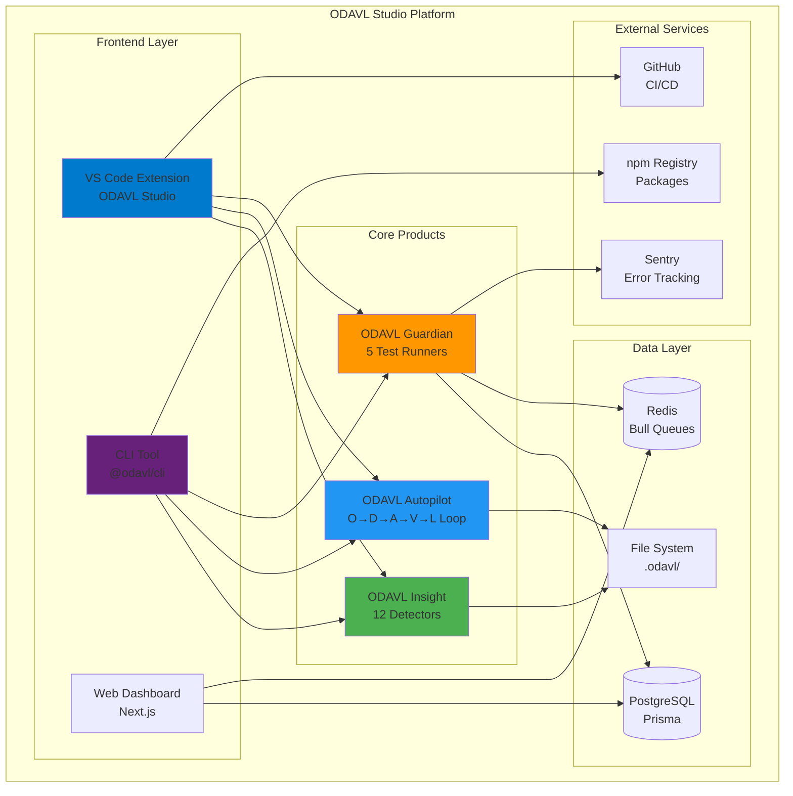

### Component Hierarchy

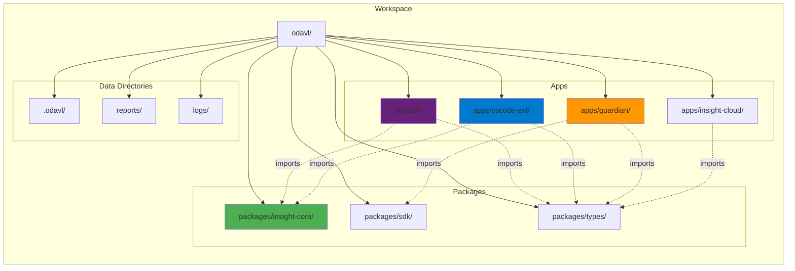

---

## 2. Product Architecture

### ODAVL Insight Architecture

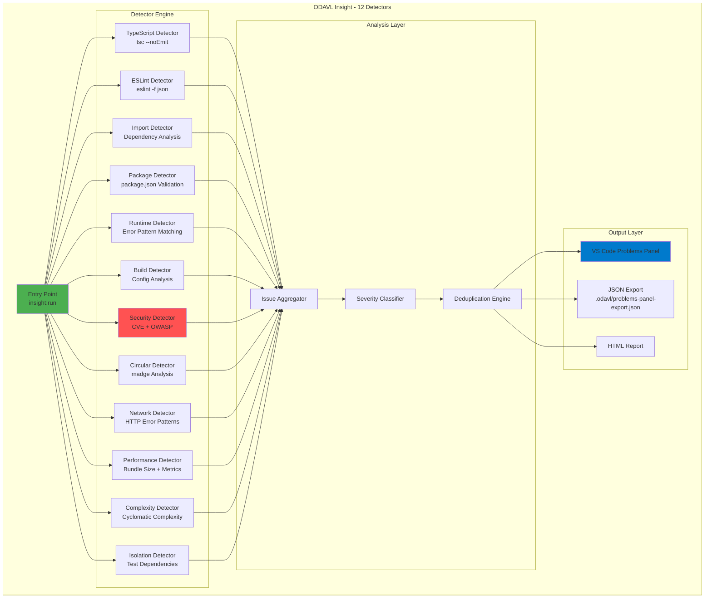

### ODAVL Autopilot Architecture

```mermaid
graph TB
    subgraph "ODAVL Autopilot - O→D→A→V→L Loop"
        Start[Start Cycle]
        
        subgraph "OBSERVE Phase"
            O1[Run Insight Detectors]
            O2[Collect Metrics]
            O3[Parse Errors/Warnings]
        end
        
        subgraph "DECIDE Phase"
            D1[Load Recipes<br/>.odavl/recipes/]
            D2[Sort by Trust Score]
            D3[Select Highest Trust Recipe]
            D4[Risk Budget Check<br/>Max 10 files, 40 LOC/file]
        end
        
        subgraph "ACT Phase"
            A1[Save Undo Snapshot<br/>.odavl/undo/]
            A2[Execute Recipe Commands]
            A3[Apply Code Changes]
            A4[Write Ledger<br/>.odavl/ledger/run-*.json]
        end
        
        subgraph "VERIFY Phase"
            V1[Re-run Quality Checks]
            V2[Compare Metrics<br/>Before vs After]
            V3[Enforce Gates<br/>.odavl/gates.yml]
            V4[Write Attestation<br/>SHA-256 Hash]
        end
        
        subgraph "LEARN Phase"
            L1[Calculate Success Rate]
            L2[Update Trust Score<br/>.odavl/recipes-trust.json]
            L3[Blacklist if Failed 3x]
            L4[Update History<br/>.odavl/history.json]
        end
        
        End[Cycle Complete]
    end
    
    Start --> O1
    O1 --> O2
    O2 --> O3
    O3 --> D1
    
    D1 --> D2
    D2 --> D3
    D3 --> D4
    
    D4 -->|Pass| A1
    D4 -->|Fail| End
    
    A1 --> A2
    A2 --> A3
    A3 --> A4
    
    A4 --> V1
    V1 --> V2
    V2 --> V3
    V3 --> V4
    
    V4 -->|Pass| L1
    V4 -->|Fail| A1
    
    L1 --> L2
    L2 --> L3
    L3 --> L4
    L4 --> End
    
    style Start fill:#2196F3
    style O1 fill:#4CAF50
    style D3 fill:#FFC107
    style A3 fill:#FF9800
    style V4 fill:#9C27B0
    style L2 fill:#00BCD4
    style End fill:#2196F3
```

### ODAVL Guardian Architecture

```mermaid
graph TB
    subgraph "ODAVL Guardian - Testing & Monitoring"
        subgraph "Pre-Deploy Testing"
            E2E[E2E Runner<br/>Playwright<br/>Video Recording]
            Visual[Visual Runner<br/>pixelmatch<br/>Screenshot Diff]
            A11y[A11y Runner<br/>axe-core<br/>WCAG 2.1 AA]
            i18n[i18n Runner<br/>9 Languages<br/>RTL Support]
            Perf[Performance Runner<br/>Core Web Vitals<br/>Lighthouse]
        end
        
        subgraph "Orchestration Layer"
            Queue[Bull Queue<br/>Redis]
            Worker[Background Worker<br/>Concurrent Jobs]
            Dashboard[Real-Time Dashboard<br/>Socket.io]
        end
        
        subgraph "Post-Deploy Monitoring"
            Logs[Winston Logging<br/>5 Log Types<br/>Daily Rotation]
            Errors[Sentry Integration<br/>Client/Server/Edge<br/>Source Maps]
            APM[Performance Monitoring<br/>APM Traces<br/>Metrics]
            Alerts[Multi-Channel Alerts<br/>Email/Slack/Webhook]
        end
        
        subgraph "Health & Metrics"
            Health[/api/health<br/>Liveness Probe]
            Ready[/api/ready<br/>Readiness Probe]
            Metrics[/api/metrics<br/>Prometheus Format]
        end
    end
    
    E2E --> Queue
    Visual --> Queue
    A11y --> Queue
    i18n --> Queue
    Perf --> Queue
    
    Queue --> Worker
    Worker --> Dashboard
    
    Worker --> Logs
    Worker --> Errors
    Worker --> APM
    
    Logs --> Alerts
    Errors --> Alerts
    APM --> Alerts
    
    Worker --> Health
    Worker --> Ready
    Worker --> Metrics
    
    style E2E fill:#FF9800
    style Queue fill:#E91E63
    style Dashboard fill:#9C27B0
    style Alerts fill:#F44336
```

---

## 3. Data Flow

### Autopilot Cycle Data Flow

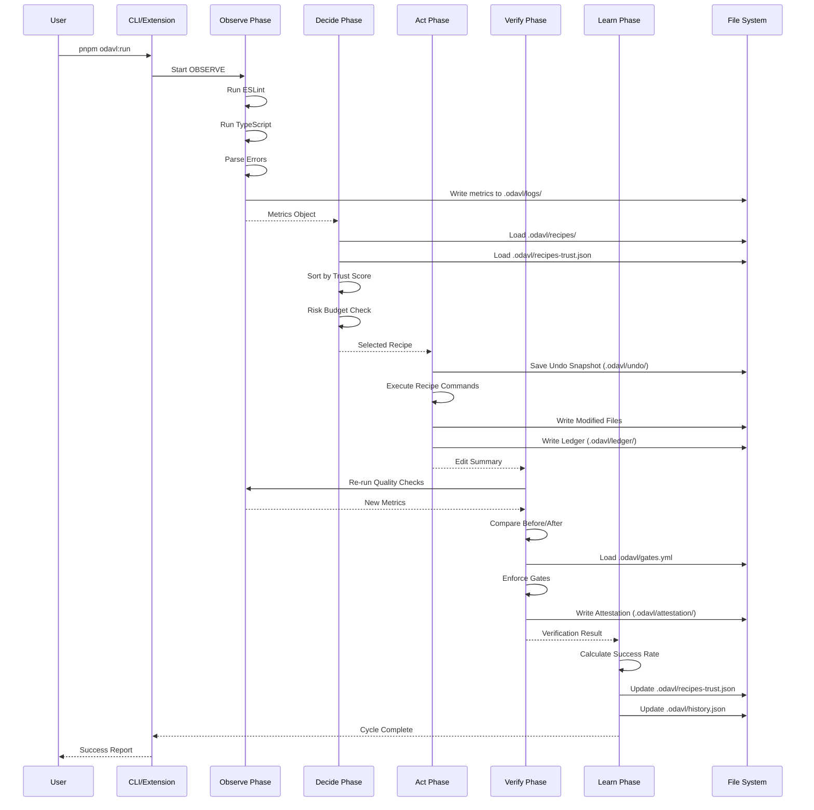

### Guardian Test Execution Flow

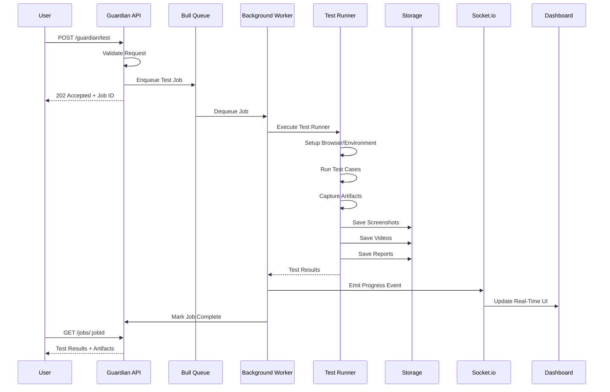

---

## 4. Deployment Architecture

### Kubernetes Deployment

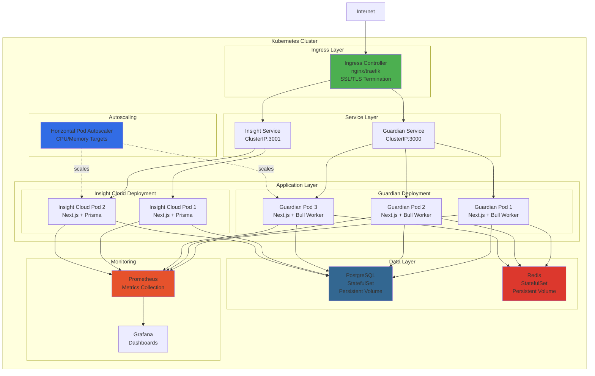

### CI/CD Pipeline

```mermaid
graph LR
    subgraph "GitHub Actions Workflow"
        subgraph "Trigger Events"
            Push[Push to main]
            PR[Pull Request]
            Tag[Tag Release]
        end
        
        subgraph "Build Stage"
            Checkout[Checkout Code]
            Install[Install Dependencies<br/>pnpm install]
            Lint[Lint + Typecheck<br/>pnpm forensic:all]
            Test[Run Tests<br/>pnpm test:coverage]
            Build[Build Apps<br/>pnpm build]
        end
        
        subgraph "Package Stage"
            Docker[Build Docker Images<br/>multi-stage build]
            Push_Registry[Push to Registry<br/>GitHub Container Registry]
            npm_Publish[Publish to npm<br/>@odavl/*]
            VSCode_Package[Package Extension<br/>.vsix]
        end
        
        subgraph "Deploy Stage"
            Staging[Deploy to Staging<br/>kubectl apply]
            Smoke[Smoke Tests<br/>Health Checks]
            Production[Deploy to Production<br/>Helm Upgrade]
        end
        
        subgraph "Verification"
            E2E[E2E Tests<br/>Guardian Runners]
            Monitor[Monitor Metrics<br/>Sentry + APM]
            Rollback{Success?}
        end
    end
    
    Push --> Checkout
    PR --> Checkout
    Tag --> Checkout
    
    Checkout --> Install
    Install --> Lint
    Lint --> Test
    Test --> Build
    
    Build --> Docker
    Build --> npm_Publish
    Build --> VSCode_Package
    
    Docker --> Push_Registry
    Push_Registry --> Staging
    
    Staging --> Smoke
    Smoke --> Production
    
    Production --> E2E
    E2E --> Monitor
    Monitor --> Rollback
    
    Rollback -->|Yes| End[Deployment Complete]
    Rollback -->|No| Revert[Helm Rollback]
    Revert --> Staging
    
    style Checkout fill:#4CAF50
    style Test fill:#2196F3
    style Docker fill:#2496ED
    style Production fill:#FF9800
    style Rollback fill:#F44336
```

---

## 5. Integration Patterns

### VS Code Extension Integration

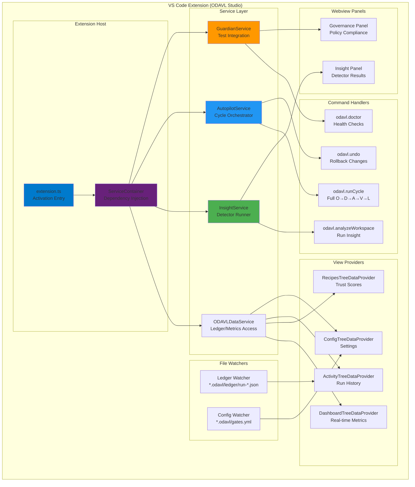

### CLI Integration

```mermaid
graph TB
    subgraph "CLI Tool (@odavl/cli)"
        subgraph "Command Router"
            Index[index.ts<br/>Command Parser]
        end
        
        subgraph "Core Commands"
            RunCmd[commands/run.ts<br/>Full Cycle]
            ObserveCmd[commands/observe.ts<br/>OBSERVE Phase]
            DecideCmd[commands/decide.ts<br/>DECIDE Phase]
            ActCmd[commands/act.ts<br/>ACT Phase]
            VerifyCmd[commands/verify.ts<br/>VERIFY Phase]
            LearnCmd[commands/learn.ts<br/>LEARN Phase]
        end
        
        subgraph "Utility Commands"
            UndoCmd[commands/undo.ts<br/>Rollback]
            FeedbackCmd[commands/feedback.ts<br/>Submit Feedback]
            RecommendCmd[commands/recommend.ts<br/>Get Recommendations]
            PlanCmd[commands/apply-plan.ts<br/>Execute Plan]
        end
        
        subgraph "Core Logic"
            Loop[core/odavl-loop.ts<br/>Cycle Orchestration]
            Budget[core/risk-budget.ts<br/>Safety Guard]
            Policies[core/policies.ts<br/>Gate Enforcement]
            PlanRunner[core/plan-runner.ts<br/>Plan Execution]
        end
        
        subgraph "I/O Wrappers"
            FSWrapper[phases/fs-wrapper.ts<br/>File System]
            CPWrapper[phases/cp-wrapper.ts<br/>Child Process]
        end
        
        subgraph "External Packages"
            InsightCore[@odavl/insight-core<br/>Detectors]
            Types[@odavl/types<br/>TypeScript Interfaces]
        end
    end
    
    Index --> RunCmd
    Index --> ObserveCmd
    Index --> DecideCmd
    Index --> ActCmd
    Index --> VerifyCmd
    Index --> LearnCmd
    Index --> UndoCmd
    Index --> FeedbackCmd
    Index --> RecommendCmd
    Index --> PlanCmd
    
    RunCmd --> Loop
    ObserveCmd --> Loop
    DecideCmd --> Loop
    ActCmd --> Loop
    VerifyCmd --> Loop
    LearnCmd --> Loop
    
    Loop --> Budget
    Loop --> Policies
    PlanCmd --> PlanRunner
    
    Loop --> FSWrapper
    Loop --> CPWrapper
    
    ObserveCmd --> InsightCore
    Loop --> Types
    
    style Index fill:#68217A
    style RunCmd fill:#2196F3
    style Loop fill:#4CAF50
    style Budget fill:#F44336
    style InsightCore fill:#4CAF50
```

---

## 6. Security Architecture

### Security Layers

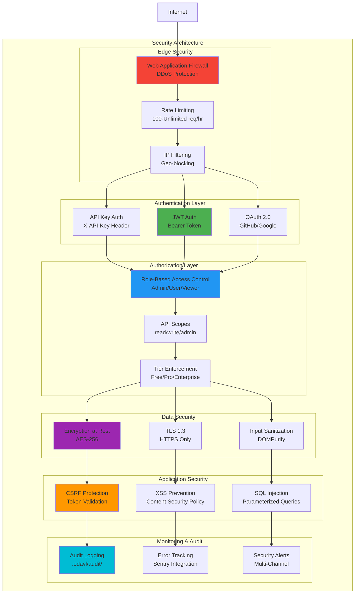

### Data Protection Flow

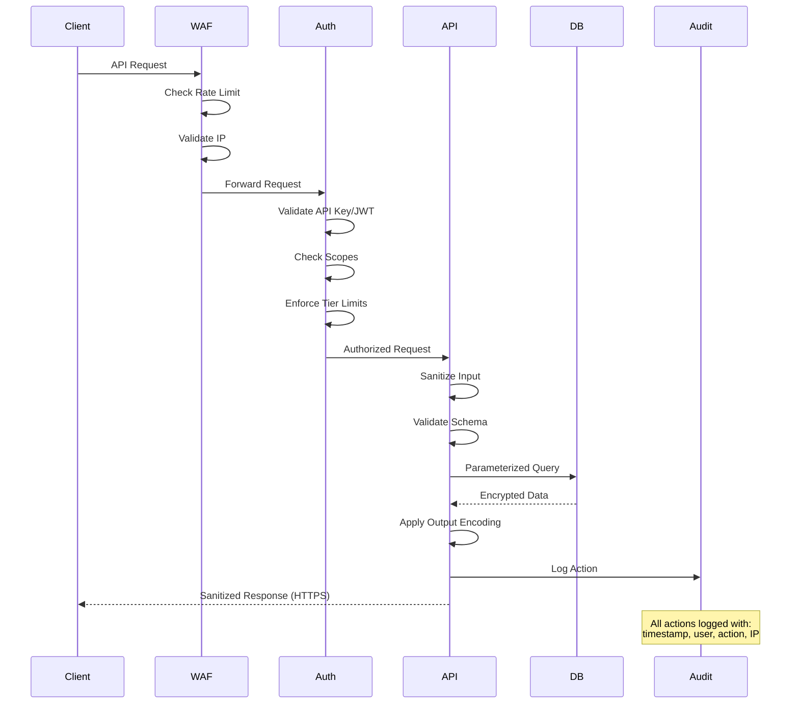

---

## Summary

These architecture diagrams provide a comprehensive view of the ODAVL Studio platform:

1. **System Overview**: High-level component relationships and workspace structure
2. **Product Architecture**: Detailed design for Insight (12 detectors), Autopilot (O→D→A→V→L), and Guardian (5 runners)
3. **Data Flow**: Sequence diagrams showing Autopilot cycles and Guardian test execution
4. **Deployment Architecture**: Kubernetes cluster design and CI/CD pipeline
5. **Integration Patterns**: VS Code extension and CLI internal architecture
6. **Security Architecture**: Multi-layer security model with authentication, authorization, and data protection

All diagrams use Mermaid.js syntax and can be rendered in:

- GitHub Markdown (native support)
- VS Code (with Mermaid extension)
- Documentation sites (mdBook, Docusaurus, etc.)
- Mermaid Live Editor (<https://mermaid.live>)

**Built with ❤️ by ODAVL Team**  
**Version**: 1.0.0  
**Last Updated**: January 9, 2025
