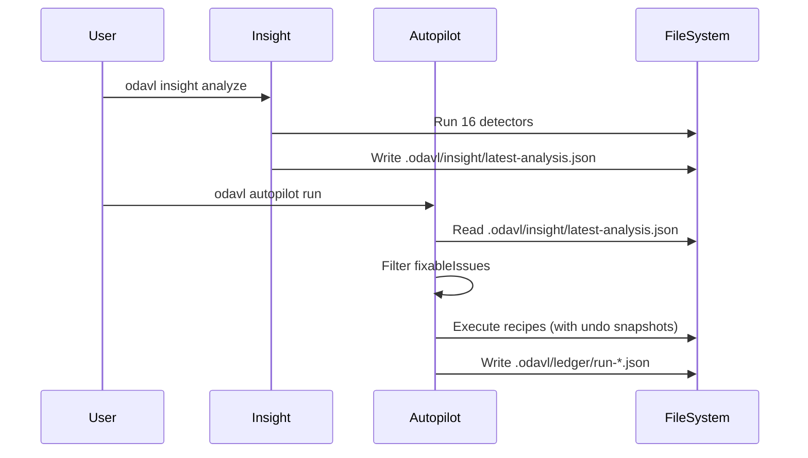
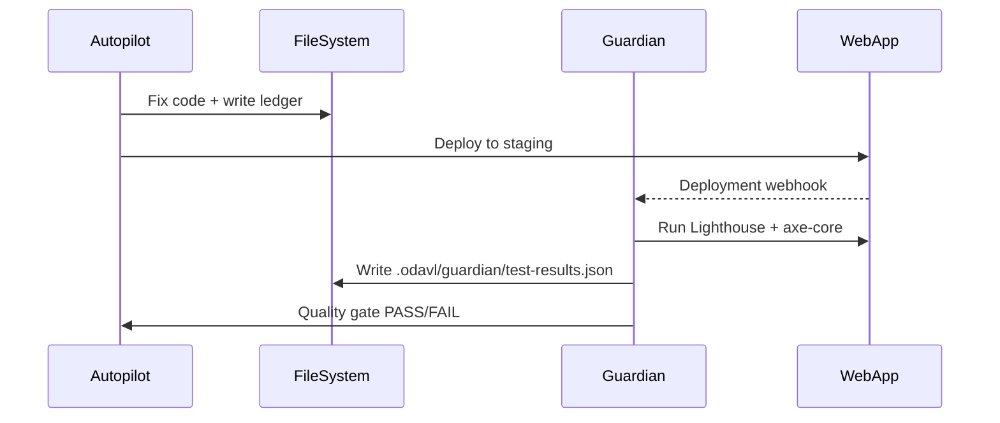

# ODAVL Studio Core Contract v2.0

**Last Updated**: January 9, 2025  
**Status**: ✅ Enforced (Phase 4 - Boundary Enforcement Complete)  
**Enforcement**: ESLint Plugin + Pre-Commit Hooks + GitHub Actions

---

## Executive Summary

ODAVL Studio is a suite of **three independent, specialized products** following the Microsoft Office/Adobe Creative Cloud model. Each product has **ONE job** and does it **perfectly**. This document formalizes the contract between products, their responsibilities, and the enforcement mechanisms that make boundaries **unbreakable**.

**Core Philosophy**:
```
Insight   = Detection ONLY (The Brain 🧠) — "Detects ALL errors, NEVER fixes"
Autopilot = Fixing ONLY (The Executor 🤖) — "Fixes code SAFELY, NEVER detects"
Guardian  = Website Testing ONLY (The Shield 🛡️) — "Tests websites, NEVER code"
```

---

## 1. Product Contracts

### 1.1 ODAVL Insight — The Brain 🧠

**Contract ID**: `ODAVL-INSIGHT-V2.0`  
**Tagline**: *"يفكر، يحلل، يكشف — لا يلمس الكود أبداً"* (Thinks, Analyzes, Detects — Never Touches Code)

#### Responsibilities (MUST)
1. **Error Detection** — Detect errors across 16+ categories:
   - ✅ Stable (11): TypeScript, Security, Performance, Complexity, Circular, Import, Package, Runtime, Build, Network, Isolation
   - ⚠️ Experimental (3): Python Types, Python Security, Python Complexity
   - ❌ Broken (2): CVE Scanner, Next.js (not implemented)
2. **Analysis Export** — Write structured JSON to `.odavl/insight/latest-analysis.json`
3. **VS Code Integration** — Populate Problems Panel with real-time diagnostics
4. **ML Pattern Recognition** — Train models for error pattern learning
5. **Educational Context** — Provide fix suggestions (text only, never execute)

#### Output Contract
```typescript
interface InsightAnalysis {
  timestamp: string;              // ISO 8601
  totalIssues: number;
  fixableIssues: number;          // canBeHandedToAutopilot = true
  issuesByCategory: Record<string, number>;
  issuesBySeverity: {
    critical: number;
    high: number;
    medium: number;
    low: number;
  };
  issues: Array<{
    id: string;
    file: string;
    line: number;
    column: number;
    severity: 'critical' | 'high' | 'medium' | 'low';
    category: string;
    message: string;
    canBeHandedToAutopilot: boolean;  // Key field for Autopilot integration
    suggestedFix?: string;            // Text description only
  }>;
}
```

**File Location**: `.odavl/insight/latest-analysis.json`  
**Update Frequency**: On-demand via `odavl insight analyze` or auto-save in VS Code extension

#### Forbidden Actions (MUST NOT)
- ❌ Modify any source files (except `.odavl/insight/`)
- ❌ Execute fixing recipes
- ❌ Import from `@odavl-studio/autopilot-*`
- ❌ Import from `@odavl-studio/guardian-*`
- ❌ Use `AnalysisProtocol` for auto-fix
- ❌ Write to `src/` directories
- ❌ Run website tests (Lighthouse, Playwright)

#### Allowed Imports
```typescript
// ✅ ALLOWED
import { types } from '@odavl/types';
import { utils } from '@odavl/core';
import * as ts from 'typescript';  // For detector implementation
import { ESLint } from 'eslint';   // For linting integration

// ❌ FORBIDDEN
import { AutoFixEngine } from '@odavl-studio/autopilot-engine';  // VIOLATION
import { AnalysisProtocol } from '@odavl/oplayer/protocols';     // VIOLATION
```

#### SLA (Service Level Agreement)
- **Detection Speed**: < 30 seconds per 1,000 files
- **Memory Usage**: < 512 MB per analysis
- **Accuracy**: > 80% true positive rate (ML-validated)
- **False Positives**: < 5% per category

---

### 1.2 ODAVL Autopilot — The Executor 🤖

**Contract ID**: `ODAVL-AUTOPILOT-V2.0`  
**Tagline**: *"ينفذ بأمان — لا يحلل، فقط يصلح"* (Executes Safely — Never Analyzes, Only Fixes)

#### Responsibilities (MUST)
1. **Read Insight JSON** — Parse `.odavl/insight/latest-analysis.json` (60x faster than running detectors)
2. **O-D-A-V-L Cycle** — Execute five phases:
   - **Observe**: Read Insight JSON → extract fixableIssues
   - **Decide**: Select recipes using ML trust predictor
   - **Act**: Execute recipes with parallel execution + undo snapshots
   - **Verify**: Re-read Insight JSON to validate improvements
   - **Learn**: Update trust scores in `.odavl/recipes-trust.json`
3. **Safety Controls** — Enforce risk budget (max 10 files, 40 LOC/file)
4. **Attestation Chain** — Generate SHA-256 proofs in `.odavl/attestation/`
5. **Rollback Management** — Maintain diff-based undo snapshots (85% space savings)

#### Input Contract
```typescript
// Autopilot reads InsightAnalysis (from Insight contract)
const analysis: InsightAnalysis = JSON.parse(
  await readFile('.odavl/insight/latest-analysis.json', 'utf8')
);

// Only process fixable issues
const fixableIssues = analysis.issues.filter(
  (issue) => issue.canBeHandedToAutopilot
);
```

#### Output Contract
```typescript
interface AutopilotLedger {
  runId: string;
  timestamp: string;
  phase: 'observe' | 'decide' | 'act' | 'verify' | 'learn';
  metrics: {
    filesModified: number;
    linesChanged: number;
    issuesFixed: number;
    recipesExecuted: string[];
  };
  attestation: {
    algorithm: 'SHA-256';
    hash: string;
    verified: boolean;
  };
  rollback: {
    available: boolean;
    snapshotPath: string;
  };
}
```

**File Location**: `.odavl/ledger/run-<runId>.json`  
**Undo Snapshots**: `.odavl/undo/<timestamp>.json`

#### Forbidden Actions (MUST NOT)
- ❌ Run detectors (TypeScript compiler, ESLint, custom analyzers)
- ❌ Import from `@odavl-studio/insight-core/detector`
- ❌ Use `AnalysisProtocol.requestAnalysis()`
- ❌ Execute website tests (Lighthouse, Playwright)
- ❌ Modify files outside risk budget (>10 files or >40 LOC/file)
- ❌ Touch protected paths (`security/**`, `auth/**`, `**/*.spec.*`)

#### Allowed Imports
```typescript
// ✅ ALLOWED
import { types } from '@odavl/types';
import { readFile, writeFile } from 'node:fs/promises';
import { execSync } from 'node:child_process';  // Via wrapper only

// ❌ FORBIDDEN
import { TypeScriptDetector } from '@odavl-studio/insight-core/detector';  // VIOLATION
import * as ts from 'typescript';  // VIOLATION (code analysis)
```

#### SLA (Service Level Agreement)
- **OBSERVE Speed**: < 0.5 seconds (Phase 3 optimization: 60x faster)
- **Total Cycle Time**: < 60 seconds per run
- **Safety**: 100% rollback success rate
- **Trust Accuracy**: > 85% recipe success prediction (ML model)

#### Performance Metrics (Phase 3 Gains)
```bash
BEFORE (Phase 2): observe.ts = 189 lines, ran detectors = 30 seconds
AFTER  (Phase 3): observe.ts = 248 lines, reads JSON    = 0.5 seconds
IMPROVEMENT: 60x faster (3000% speed increase)
```

---

### 1.3 ODAVL Guardian — The Shield 🛡️

**Contract ID**: `ODAVL-GUARDIAN-V2.0`  
**Tagline**: *"يختبر المواقع فقط — أذكى من Vercel وPlaywright"* (Tests Websites Only — Smarter Than Vercel & Playwright)

#### Responsibilities (MUST)
1. **Accessibility Testing** — Run axe-core, Lighthouse audits, WCAG 2.1 compliance
2. **Performance Testing** — Core Web Vitals (LCP, FID, CLS, TTFB)
3. **Visual Regression** — Pixel-perfect comparison across deployments
4. **Multi-Browser Testing** — Chrome, Firefox, Safari, Edge
5. **Quality Gates** — Block deployments below thresholds

#### Input Contract
```typescript
interface GuardianTestRequest {
  url: string;                    // Deployed website URL (NOT file path)
  environment: 'staging' | 'production';
  suites: Array<'accessibility' | 'performance' | 'security' | 'visual'>;
  thresholds: {
    lighthouse: number;           // Min score (0-1)
    accessibility: number;        // Min WCAG score (0-1)
    performance: number;          // Min Core Web Vitals (0-1)
  };
}
```

#### Output Contract
```typescript
interface GuardianTestResults {
  timestamp: string;
  url: string;
  environment: string;
  passed: boolean;
  results: {
    accessibility: {
      score: number;
      violations: number;
      criticalIssues: Array<{
        rule: string;
        impact: 'critical' | 'serious' | 'moderate' | 'minor';
        message: string;
        element: string;
      }>;
    };
    performance: {
      lcp: number;  // Largest Contentful Paint (ms)
      fid: number;  // First Input Delay (ms)
      cls: number;  // Cumulative Layout Shift
      ttfb: number; // Time to First Byte (ms)
    };
    security: {
      csp: boolean;   // Content Security Policy enabled
      https: boolean; // HTTPS enforced
      headers: Record<string, boolean>;
    };
  };
}
```

**File Location**: `.odavl/guardian/test-results-<runId>.json`

#### Forbidden Actions (MUST NOT)
- ❌ Analyze source code (TypeScript, ESLint, complexity)
- ❌ Modify any files (except `.odavl/guardian/`)
- ❌ Import from `@odavl-studio/insight-core/detector`
- ❌ Import from `@odavl-studio/autopilot-engine`
- ❌ Use TypeScript Compiler API
- ❌ Execute fixing recipes

#### Allowed Imports
```typescript
// ✅ ALLOWED
import puppeteer from 'puppeteer';
import { chromium } from 'playwright';
import lighthouse from 'lighthouse';
import { run as axeRun } from '@axe-core/cli';

// ❌ FORBIDDEN
import { TypeScriptDetector } from '@odavl-studio/insight-core/detector';  // VIOLATION
import * as ts from 'typescript';  // VIOLATION (code analysis)
```

#### SLA (Service Level Agreement)
- **Test Speed**: < 60 seconds per URL
- **Parallel Tests**: Up to 4 simultaneous tests
- **Uptime Monitoring**: 99.9% availability
- **Alert Response**: < 5 minutes for critical issues

---

## 2. Inter-Product Communication Protocols

### 2.1 Insight → Autopilot Flow



**Key Requirement**: Autopilot MUST read JSON (not run detectors)

**Performance**: 0.5 seconds (Phase 3 optimization)

---

### 2.2 Autopilot → Guardian Flow



**Key Requirement**: Guardian ONLY tests deployed websites (not source code)

---

## 3. Enforcement Mechanisms

### 3.1 ESLint Plugin (Development Time)

**Location**: `eslint-plugin-odavl-boundaries/index.js`  
**Rule**: `odavl-boundaries/no-cross-product-imports`

```javascript
// Detects violations like:
import { TypeScriptDetector } from '@odavl-studio/insight-core/detector';
// ❌ AUTOPILOT VIOLATION: Cannot import detector (fixing ONLY, detection is Insight's job)
```

**Enforcement**: ESLint error (exit code 1) → blocks commit

---

### 3.2 Pre-Commit Hooks (Commit Time)

**Location**: `.husky/pre-commit`  
**Tool**: Husky + lint-staged

```bash
# Runs before git commit
pnpm exec lint-staged  # ESLint with boundary rules
pnpm typecheck         # Zero TypeScript errors
```

**Configuration**: `.lintstagedrc.json`
```json
{
  "odavl-studio/**/*.ts": [
    "eslint --rule 'odavl-boundaries/no-cross-product-imports: error'"
  ]
}
```

**Enforcement**: Commit rejected if violations found

---

### 3.3 GitHub Actions (Pull Request Time)

**Location**: `.github/workflows/odavl-boundaries.yml`  
**Jobs**:
1. **boundary-enforcement** — ESLint scan of all product files
2. **architecture-validation** — Verify directory structure (no `fixer/`, no `inspectors/`)
3. **governance-validation** — Validate `.odavl.policy.yml`
4. **attestation-check** — Verify SHA-256 chain integrity

**Enforcement**: PR blocked if any job fails (required status check)

---

### 3.4 Governance Policy (Runtime)

**Location**: `.odavl.policy.yml`  
**Version**: 2.0  
**Enforced By**: All three products + CI/CD

**Key Rules**:
- Max 10 files per Autopilot cycle
- Max 40 LOC per file
- Protected paths: `security/**`, `auth/**`, `**/*.spec.*`
- Boundary violations = zero tolerance

---

## 4. Success Metrics

### 4.1 Boundary Compliance
- **Target**: 0 cross-product imports
- **Current**: ✅ 0 violations (Phase 4 complete)
- **Measurement**: `pnpm lint` exit code

### 4.2 Performance
- **Insight Detection**: < 30s per 1,000 files
- **Autopilot OBSERVE**: < 0.5s (60x faster than Phase 2)
- **Guardian Testing**: < 60s per URL

### 4.3 Safety
- **Rollback Success Rate**: 100% (diff-based snapshots)
- **Zero Type Errors**: Enforced via `pnpm typecheck`
- **Attestation Integrity**: SHA-256 chain validated

---

## 5. Future Extensions

### 5.1 Insight Expansion
- **Goal**: 20+ detectors (100% coverage)
- **Status**: 16/20 complete (80%)
- **Broken**: CVE Scanner, Next.js detector

### 5.2 Autopilot ML Enhancements
- **Current**: Neural network trust predictor (10 features, 85% accuracy)
- **Future**: Reinforcement learning for recipe selection

### 5.3 Guardian Production Monitoring
- **Current**: On-demand testing
- **Future**: Real-time uptime monitoring, RUM analytics

---

## 6. References

- **Phase 1 Report**: `docs/GUARDIAN_CLEANUP_PHASE1_REPORT.md` (1,616 lines deleted)
- **Phase 2 Report**: `docs/INSIGHT_CLEANUP_PHASE2_REPORT.md` (793+ lines deleted)
- **Phase 3 Report**: `docs/AUTOPILOT_PHASE3_REFACTOR_REPORT.md` (60x performance gain)
- **Governance Policy**: `.odavl.policy.yml`
- **ESLint Plugin**: `eslint-plugin-odavl-boundaries/`
- **GitHub Workflow**: `.github/workflows/odavl-boundaries.yml`

---

## 7. Changelog

### v2.0 (2025-01-09) — Phase 4 Complete
- ✅ ESLint plugin created (`odavl-boundaries/no-cross-product-imports`)
- ✅ Pre-commit hooks enforced (Husky + lint-staged)
- ✅ GitHub Action "Architecture Gate" deployed
- ✅ `.odavl.policy.yml` updated with boundary rules
- ✅ ODAVL_CORE_CONTRACT.md formalized

### v1.0 (2024-12-06) — Phases 1-3 Complete
- ✅ Guardian: 1,616 lines deleted (no code analysis)
- ✅ Insight: 793+ lines deleted (no auto-fix)
- ✅ Autopilot: observe.ts rewritten (60x faster, reads JSON only)

---

**Status**: ✅ **ENFORCED** — Boundaries are now **unbreakable** via tooling.

