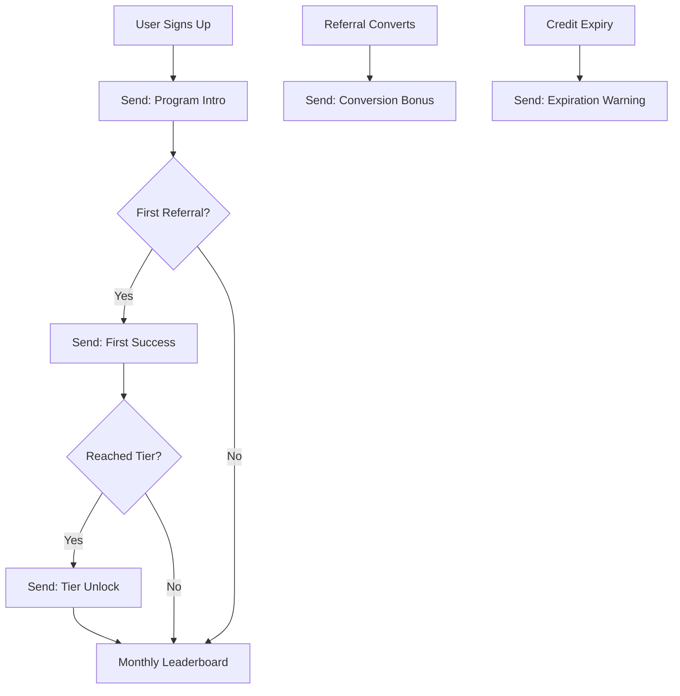

# Referral Reward Emails

## Email 1: Referral Program Introduction

**Trigger**: User signs up or completes onboarding

**Subject**: Invite Friends, Unlock Rewards 🎁

**Body**:
```html
Hey {{firstName}},

Want free ODAVL credits? Invite your dev friends.

**How It Works**:

1. **Share Your Link**
   {{referralLink}}

2. **Friends Sign Up**
   They get 30-day free trial + $10 credit

3. **You Get Rewarded**
   $50 credit per signup (stackable)

**Bonus Tiers**:

🥉 **Bronze** (0 invites): Beta access
🥈 **Silver** (3 invites): Priority support + custom themes
🥇 **Gold** (10 invites): $50 credit + dedicated CSM
💎 **Platinum** (25 invites): $200 credit + lifetime Pro

**Current Progress**:
{{invitesSent}} invites sent
{{tiersUnlocked}} tiers unlocked
Next reward at {{nextMilestone}} invites

[Start Referring →]

**Top Referrers This Month**:
1. Sarah M. - 47 invites ($2,350 earned)
2. John D. - 32 invites ($1,600 earned)
3. Mike L. - 28 invites ($1,400 earned)

Ready to earn?

— ODAVL Team
```

---

## Email 2: First Referral Success

**Trigger**: User's first referral signs up

**Subject**: 🎉 Your First Referral! ($50 Credit Unlocked)

**Body**:
```html
Awesome news, {{firstName}}!

**{{friendName}}** just signed up using your link.

**Your Reward**:
✅ $50 credit added to your account
✅ Credit never expires
✅ Applies to Pro/Enterprise plans

**Current Balance**: ${{totalCredits}}

**Next Milestone**:
Invite 2 more friends → Unlock Silver Tier
Silver perks:
• Priority support (24-hour response)
• Custom theme builder
• Profile badge

**Share Again**:
{{referralLink}}

**Pro Tip**:
Post on Twitter/LinkedIn with your link. Devs love discovering tools from peers.

Keep inviting!

— Team ODAVL

P.S. View your referral dashboard: odavl.com/referral
```

---

## Email 3: Tier Milestone Unlocked

**Trigger**: User reaches Silver/Gold/Platinum tier

**Subject**: 🥈 Silver Tier Unlocked - Welcome to VIP Status

**Body**:
```html
Congrats, {{firstName}}!

You've unlocked **Silver Tier** (3+ referrals).

**Your New Perks**:

✅ **Priority Support**
• 24-hour response time (was 48)
• Dedicated support channel

✅ **Custom Theme Builder**
• Brand your ODAVL dashboard
• White-label for clients

✅ **Profile Badge**
• "Silver Referrer" badge on dashboard
• Show off your contributor status

**Current Stats**:
• Invites sent: {{invitesSent}}
• Credits earned: ${{totalCredits}}
• Tier: {{currentTier}}

**Next Milestone**:
Gold Tier (10 invites):
• $50 credit bonus
• Dedicated Customer Success Manager
• Roadmap input (feature voting)
• ODAVL swag package

**Keep Going**:
You're 7 invites away from Gold.

[Share Your Link →]

Enjoy your perks!

— ODAVL Team
```

---

## Email 4: Referral Leaderboard Update

**Trigger**: Monthly (first of each month)

**Subject**: January Referral Leaderboard 🏆

**Body**:
```html
{{firstName}}, here's this month's referral leaderboard:

**Top 10 Referrers (January 2025)**:

1. 🥇 Sarah M. - 47 invites ($2,350)
2. 🥈 John D. - 32 invites ($1,600)
3. 🥉 Mike L. - 28 invites ($1,400)
4. Emma K. - 19 invites ($950)
5. Chris P. - 15 invites ($750)
6. Lisa R. - 12 invites ($600)
7. David S. - 11 invites ($550)
8. **{{userName}} - {{invitesSent}} invites (${{creditsEarned}})** ← You are here
9. Alex T. - 8 invites ($400)
10. Rachel W. - 7 invites ($350)

**Your Rank**: #{{userRank}} out of {{totalReferrers}}

**Your Stats This Month**:
• Invites: {{monthlyInvites}}
• Credits earned: ${{monthlyCredits}}
• Conversions: {{conversionRate}}%

**Winner Spotlight**:
Sarah M. shared ODAVL on her YouTube channel (12K subs).
Result: 47 signups in 30 days.

**Pro Tips from Top Referrers**:
1. "Share on Twitter with screenshot" - John D.
2. "Post in dev communities (Reddit, Discord)" - Mike L.
3. "Include in email signature" - Emma K.

**Can You Reach Top 5?**
{{invitesNeeded}} more invites would get you there.

[Start Referring →]

Good luck!

— ODAVL Team
```

---

## Email 5: Credit Expiration Warning

**Trigger**: Credits expiring in 30 days (only if expiration enabled)

**Subject**: ${{expiringAmount}} Credit Expires in 30 Days

**Body**:
```html
Hey {{firstName}},

You have **${{expiringAmount}} in credits** expiring on {{expirationDate}}.

**Use Them Before They're Gone**:

✅ Upgrade to Pro (applies automatically)
✅ Add team members (extra seats)
✅ Purchase enterprise features

**Current Balance**:
• Total credits: ${{totalCredits}}
• Expiring soon: ${{expiringAmount}}
• Safe credits: ${{safeCredits}}

**How to Use**:
Credits apply automatically at checkout.
No action needed - just upgrade!

[Upgrade to Pro →]

**Referral Credits Never Expire**:
Keep earning more. Each referral = $50 credit.

Questions? Reply to this email.

— ODAVL Team

P.S. This is a courtesy reminder. We don't want you to lose rewards you earned!
```

---

## Email 6: Referral Conversion Update

**Trigger**: Referred user converts to paid plan

**Subject**: 💰 Bonus! {{friendName}} Upgraded (Extra $25 for You)

**Body**:
```html
Great news, {{firstName}}!

**{{friendName}}** (your referral) just upgraded to Pro.

**Your Bonus**:
✅ $25 additional credit (on top of initial $50)
✅ Total earned from this referral: $75

**Why the Bonus**:
We reward high-quality referrals. When your invites convert to paid, you earn extra.

**Lifetime Value**:
• Referrals: {{totalReferrals}}
• Conversions: {{paidConversions}}
• Conversion rate: {{conversionRate}}%
• Total earned: ${{lifetimeEarnings}}

**Top Converter Perks**:
If you maintain >20% conversion rate:
• 2x referral bonus ($100 per signup)
• Platinum tier fast-track
• Featured on referral hall of fame

**Keep Inviting**:
[Share Your Link →]

Thanks for spreading the word!

— ODAVL Team
```

---

## Referral Email Automation Flow



**Best Practices**:
- Don't spam - max 1 referral email per week
- Celebrate milestones immediately
- Make earning mechanics transparent
- Show social proof (leaderboards)
