# 🎨 ODAVL Studio - Visual Assets Production Guide

**Target**: Product Hunt Launch + Marketing Materials  
**Timeline**: Day 7 (4-6 hours production time)  
**Tools**: Chrome DevTools, OBS/ScreenFlow, Figma/Canva

---

## 📸 Screenshot Requirements (10 Total)

### Technical Specifications
- **Resolution**: 1920x1080 (1080p)
- **Format**: PNG (with transparency where applicable)
- **Color Profile**: sRGB
- **File Size**: <500KB per screenshot (optimize with TinyPNG)
- **Naming**: `screenshot-{number}-{description}.png`

### Quality Standards
- **Clean UI**: No debug overlays, console errors, or placeholder text
- **Real Data**: Use realistic project names, error counts, etc.
- **Consistent Branding**: ODAVL logo visible where appropriate
- **Professional**: Dark mode preferred (modern developer aesthetic)

---

## 🖼️ Screenshot #1: Hero Dashboard

**Page**: `odavl-studio/insight/cloud/app/global-insight/page.tsx`  
**Purpose**: First impression - show global intelligence dashboard  
**What to capture**: Full dashboard with error signatures, metrics, detector grid

### Preparation Steps
```bash
# Start Insight Cloud
cd odavl-studio/insight/cloud
pnpm dev

# Navigate to: http://localhost:3001/global-insight
```

### Screenshot Composition
- **Top**: Navigation bar with ODAVL logo, dark mode toggle
- **Center**: 
  - "Global Error Signatures" heading
  - Summary cards (Total Projects, Error Signatures, Active Errors, Resolution Rate)
  - Error signatures table with 5-8 rows
- **Bottom**: Detector grid (12 cards in 4x3 layout)

### Data Setup (Before Screenshot)
```typescript
// If database is empty, seed with realistic data:
// Run: tsx scripts/seed-demo-data.ts

// Expected data:
// - 8 projects
// - 45 error signatures
// - 127 active errors
// - 78% resolution rate
```

### Screenshot Tips
- **Zoom**: 100% (no browser zoom)
- **Window**: Fullscreen (F11) to hide browser chrome
- **Cursor**: Hide cursor or position off-screen
- **Timing**: Wait for all animations to complete
- **Highlight**: Optional - add subtle glow to key metrics

---

## 🖼️ Screenshot #2: Detector Grid (Close-up)

**Page**: Same as #1, but scroll to detector grid  
**Purpose**: Show 12 specialized detectors with icons

### Composition
- **Focus**: 12 detector cards only (crop out rest of page)
- **Layout**: 4 columns x 3 rows
- **Content**: Each card shows:
  - Icon (e.g., 🔍 for TypeScript, 🔒 for Security)
  - Detector name
  - Brief description
  - Issue count (e.g., "23 issues found")

### Detectors to Show
1. TypeScript Detector (🔍) - "Type errors & strict mode"
2. ESLint Detector (📏) - "Code style & best practices"
3. Import Detector (🔗) - "Unused & circular imports"
4. Package Detector (📦) - "Dependency issues"
5. Runtime Detector (⚡) - "Memory leaks & performance"
6. Build Detector (🏗️) - "Build errors & warnings"
7. Security Detector (🔒) - "Vulnerabilities & secrets"
8. Circular Detector (🔄) - "Circular dependencies"
9. Network Detector (🌐) - "API & network issues"
10. Performance Detector (⚡) - "Bundle size & speed"
11. Complexity Detector (📊) - "Cyclomatic complexity"
12. Isolation Detector (🧪) - "Test isolation issues"

### Screenshot Tips
- **Padding**: Leave 50px white space around grid
- **Shadows**: Ensure card shadows are visible
- **Icons**: Verify all icons load correctly
- **Alignment**: Cards should be perfectly aligned

---

## 🖼️ Screenshot #3: Error Details & Fix Recommendations

**Page**: `odavl-studio/insight/cloud/app/signatures/[id]/page.tsx`  
**Purpose**: Show ML-powered fix recommendations with confidence scoring

### Preparation
```bash
# Navigate to specific error signature
# URL: http://localhost:3001/signatures/clx12345abc

# If no signatures exist, create one:
# 1. Run detector: odavl insight analyze
# 2. Error will be uploaded to database
# 3. View in dashboard
```

### Composition
- **Top**: Error signature summary
  - Error message: "Cannot find module './utils/helpers'"
  - Frequency: "Occurs in 12 projects"
  - Severity: "High" (red badge)
- **Center**: Fix recommendations (3-5 options)
  - Option 1: "Install missing package" (Confidence: 95%)
  - Option 2: "Fix import path" (Confidence: 87%)
  - Option 3: "Create missing file" (Confidence: 72%)
- **Bottom**: 
  - Code diff preview
  - "Apply Fix" button (primary CTA)

### Screenshot Tips
- **Zoom**: Focus on fix recommendations section
- **Highlight**: Circle or arrow pointing to confidence scores
- **Contrast**: Ensure fix options are clearly distinguishable

---

## 🖼️ Screenshot #4: Autopilot O-D-A-V-L Cycle

**Page**: Create visualization in Figma/Excalidraw  
**Purpose**: Show autonomous fix cycle visually

### Design Requirements
- **Layout**: Circular flow diagram (clockwise)
- **5 Phases**: 
  1. **Observe** (🔍): "Detect 127 errors"
  2. **Decide** (🧠): "Select recipe (trust: 0.92)"
  3. **Act** (⚙️): "Apply fix to 8 files"
  4. **Verify** (✅): "Errors reduced to 95 (-25%)"
  5. **Learn** (📚): "Update trust score → 0.94"

### Visual Elements
- **Arrows**: Connect phases in circular flow
- **Icons**: Use emojis or custom icons
- **Colors**:
  - Observe: Blue (#3B82F6)
  - Decide: Purple (#8B5CF6)
  - Act: Orange (#F97316)
  - Verify: Green (#10B981)
  - Learn: Yellow (#FBBF24)
- **Center**: "O-D-A-V-L Cycle" logo

### Tools
- **Option 1**: Figma (professional, vector)
- **Option 2**: Excalidraw (hand-drawn, friendly)
- **Option 3**: Mermaid.js (code-based, quick)

```mermaid
graph LR
    A[Observe<br/>🔍 Detect errors] --> B[Decide<br/>🧠 Select recipe]
    B --> C[Act<br/>⚙️ Apply fix]
    C --> D[Verify<br/>✅ Check quality]
    D --> E[Learn<br/>📚 Update trust]
    E --> A
```



---

## 🖼️ Screenshot #5: VS Code Integration

**Page**: VS Code editor with ODAVL extension active  
**Purpose**: Show real-time error detection in developer workflow

### Preparation
```bash
# Install ODAVL VS Code extension (if not already)
code --install-extension odavl-studio.odavl-insight

# Open a project with errors
code ~/dev/sample-project
```

### Composition
- **Left**: File explorer showing project structure
- **Center**: 
  - Code editor with file open (e.g., `src/index.ts`)
  - Red squiggly lines under errors
  - ODAVL error message in hover tooltip
- **Bottom**: 
  - Problems Panel showing ODAVL errors
  - Filter: "ODAVL" tab selected
  - 5-10 errors listed with severity icons

### Screenshot Tips
- **Theme**: Dark+ (default dark) or Dracula
- **Font**: Fira Code or JetBrains Mono (ligatures enabled)
- **Zoom**: 130% for readability
- **Focus**: Make sure ODAVL errors are prominent

---

## 🖼️ Screenshot #6: Guardian Results Table

**Page**: `odavl-studio/insight/cloud/app/guardian/page.tsx`  
**Purpose**: Show pre-deploy testing results with scores

### Preparation
```bash
# Run Guardian test first to populate database
cd odavl-studio/guardian/core
pnpm build
node dist/cli.js test https://example.com

# Then view results in dashboard
cd ../../../odavl-studio/insight/cloud
pnpm dev
# Navigate to: http://localhost:3001/guardian
```

### Composition
- **Top**: "Guardian Quality Tests" heading
- **Summary Cards** (4 cards):
  - Total Tests: 12
  - Passed: 9 (75%)
  - Failed: 3 (25%)
  - Avg Score: 82/100
- **Results Table**:
  - Columns: URL | Date | Overall | Accessibility | Performance | Security | Status
  - 8-10 rows with color-coded scores:
    - Green (90-100): Excellent
    - Yellow (70-89): Good
    - Red (0-69): Failed

### Data Setup
```typescript
// Expected test results (seed if needed):
[
  { url: 'https://example.com', overall: 95, accessibility: 98, performance: 94, security: 93, passed: true },
  { url: 'https://test-app.com', overall: 78, accessibility: 82, performance: 76, security: 75, passed: true },
  { url: 'https://demo.com', overall: 65, accessibility: 58, performance: 72, security: 65, passed: false },
  // ... 5 more
]
```

### Screenshot Tips
- **Highlight**: Circle or arrow pointing to failed test (shows blocking)
- **Color**: Ensure red/yellow/green are clearly visible
- **Export**: Show "Export" button in top-right

---

## 🖼️ Screenshot #7: Guardian Summary Cards (Close-up)

**Page**: Same as #6, but zoom to summary cards  
**Purpose**: Show key metrics at a glance

### Composition
- **Focus**: 4 summary cards only (crop out table)
- **Layout**: 4 cards in a row
- **Content**:
  1. **Total Tests** (🧪): "12 tests run"
  2. **Accessibility** (👁️): "Score: 85/100"
  3. **Performance** (⚡): "Score: 78/100"
  4. **Security** (🔒): "Score: 92/100"

### Design Elements
- **Icons**: Large (48px) at top of each card
- **Numbers**: Bold, 32px font
- **Colors**: Blue, Green, Orange, Red (matching severity)
- **Shadows**: Subtle card shadows for depth

---

## 🖼️ Screenshot #8: Dark Mode Toggle

**Page**: Any dashboard page with toggle visible  
**Purpose**: Show modern UI with theme switching

### Composition
- **Side-by-Side**: Two screenshots merged
  - Left half: Light mode
  - Right half: Dark mode
- **Focus**: Same page content in both modes
- **Toggle**: Circle dark mode toggle button in top-right

### Screenshot Steps
1. Capture light mode (default theme)
2. Click dark mode toggle (Moon icon)
3. Capture dark mode
4. Merge in image editor (Photoshop, Canva, or Figma)
5. Add vertical divider line in center

### Screenshot Tips
- **Alignment**: Ensure both sides are pixel-perfect aligned
- **Transition**: Add subtle arrow or "→" between modes
- **Label**: Small text labels "Light Mode" and "Dark Mode"

---

## 🖼️ Screenshot #9: Export Dropdown

**Page**: Any dashboard page with export button  
**Purpose**: Show data export capabilities

### Composition
- **Focus**: Export button with dropdown open
- **Dropdown Options**:
  - 📄 Export as PDF
  - 📊 Export as CSV
  - 📋 Copy to Clipboard
- **Background**: Slightly blur background to focus on dropdown

### Screenshot Tips
- **Timing**: Capture immediately after clicking Export button
- **Hover**: Show hover state on one of the options
- **Cursor**: Keep cursor visible on hovered option
- **Annotation**: Optional - add text "One-click data export"

---

## 🖼️ Screenshot #10: CLI Output

**Page**: Terminal window (Windows Terminal, iTerm2, or Hyper)  
**Purpose**: Show developer-friendly CLI experience

### Preparation
```bash
# Run Guardian CLI with colorful output
cd odavl-studio/guardian/core
node dist/cli.js test https://example.com
```

### Composition
- **Top**: Command prompt showing `odavl guardian test https://example.com`
- **Center**: 
  - Loading spinner or progress bar
  - Test results with colored output:
    - ✅ Green for passed tests
    - ❌ Red for failed tests
    - ⚠️ Yellow for warnings
  - Summary statistics
- **Bottom**: Next steps or CTA

### Terminal Setup
- **Theme**: One Dark or Dracula (dark background)
- **Font**: Fira Code 14pt with ligatures
- **Colors**: Ensure ANSI colors are vibrant
- **Size**: 100 columns x 30 rows

### Screenshot Tips
- **Clean**: No unrelated terminal history above command
- **Focus**: Crop to just the relevant output
- **Readability**: 130% zoom if needed

---

## 🎬 Demo Video Requirements (60 seconds)

### Video Specifications
- **Resolution**: 1920x1080 (1080p)
- **Frame Rate**: 30 FPS
- **Format**: MP4 (H.264 codec)
- **File Size**: <50MB (Product Hunt limit)
- **Audio**: Background music (royalty-free) + voiceover OR silent with captions
- **Length**: 60 seconds (strict)

### Storyboard (6 scenes × 10 seconds each)

#### Scene 1 (0-10s): Problem Statement
- **Visual**: Split-screen showing frustrated developer + bug reports
- **Text Overlay**: 
  - "Developers spend 40% of time fixing bugs"
  - "Technical debt grows faster than you can fix it"
- **Transition**: Fade to ODAVL logo

#### Scene 2 (10-20s): ODAVL Insight
- **Visual**: Screen recording of Insight dashboard
- **Actions**:
  - Navigate to global-insight page
  - Hover over error signature
  - Click to see fix recommendations
- **Text Overlay**: "AI-Powered Error Detection - 12 Detectors, 99% Accuracy"
- **Voiceover**: "ODAVL Insight finds 95% of issues before they reach production"

#### Scene 3 (20-35s): ODAVL Autopilot
- **Visual**: Terminal showing O-D-A-V-L cycle execution
- **Actions**:
  - Run `odavl autopilot run`
  - Show phases: Observe → Decide → Act → Verify → Learn
  - Display success: "Fixed 12 errors in 3 files"
- **Text Overlay**: "Self-Healing Code - Fixes 80% Automatically"
- **Voiceover**: "Autopilot fixes routine issues while you sleep - safely and reversibly"

#### Scene 4 (35-50s): ODAVL Guardian
- **Visual**: Guardian test running + results dashboard
- **Actions**:
  - Run `odavl guardian test https://example.com`
  - Show loading → results with scores
  - Dashboard view with color-coded table
- **Text Overlay**: "Pre-Deploy Testing - Block Bad Code Before Release"
- **Voiceover**: "Guardian ensures accessibility, performance, and security before every deploy"

#### Scene 5 (50-60s): CTA
- **Visual**: All three products on screen with logos
- **Text Overlay**:
  - "Join the Beta Today"
  - "odavl.studio/beta"
  - "First 100 Users: Lifetime 50% Discount"
- **Voiceover**: "Sign up for free beta access and get 50% off for life"

### Production Tools
- **Screen Recording**: OBS Studio (free), ScreenFlow (Mac), Camtasia
- **Editing**: DaVinci Resolve (free), Adobe Premiere Pro, Final Cut Pro
- **Audio**: Audacity (free) for voiceover, Epidemic Sound for music
- **Captions**: Rev.com or auto-generate in YouTube Studio

### Recording Tips
- **Cursor**: Use large cursor (2x size) or circle highlight
- **Smoothness**: 30 FPS minimum, no lag
- **Cuts**: Keep transitions smooth (1-second fades)
- **Text**: Sans-serif font (Inter, Roboto), 48pt minimum
- **Pacing**: Slow enough to read text (3 seconds per screen)

---

## 🎨 Logo & Branding Assets

### ODAVL Studio Logo
- **Primary**: Full color logo with "ODAVL Studio" text
- **Icon**: "O" with circuit pattern (favicon size 512x512)
- **Variations**: 
  - Light background: Dark logo
  - Dark background: White logo
  - Transparent PNG for overlays

### Color Palette
```css
/* Primary */
--odavl-blue: #3B82F6;
--odavl-purple: #8B5CF6;

/* Semantic */
--success: #10B981;
--warning: #FBBF24;
--error: #EF4444;
--info: #3B82F6;

/* Neutrals */
--gray-900: #111827;
--gray-800: #1F2937;
--gray-700: #374151;
--gray-600: #4B5563;
--gray-500: #6B7280;
```

### Typography
- **Headings**: Inter (semi-bold, 600)
- **Body**: Inter (regular, 400)
- **Code**: Fira Code (ligatures enabled)

---

## 📋 Production Checklist

### Pre-Production
- [ ] Start Insight Cloud dev server (`pnpm dev`)
- [ ] Seed database with demo data (`tsx scripts/seed-demo-data.ts`)
- [ ] Install VS Code extension (`code --install-extension ...`)
- [ ] Set up terminal theme (One Dark, Fira Code)
- [ ] Clear browser cache/history for clean screenshots

### Screenshot Production (10 total)
- [ ] Screenshot 1: Hero Dashboard (global-insight page)
- [ ] Screenshot 2: Detector Grid (12 cards)
- [ ] Screenshot 3: Error Details (fix recommendations)
- [ ] Screenshot 4: Autopilot Cycle (Figma diagram)
- [ ] Screenshot 5: VS Code Integration (Problems Panel)
- [ ] Screenshot 6: Guardian Results (table with scores)
- [ ] Screenshot 7: Guardian Summary Cards (close-up)
- [ ] Screenshot 8: Dark Mode Toggle (side-by-side)
- [ ] Screenshot 9: Export Dropdown (PDF/CSV options)
- [ ] Screenshot 10: CLI Output (terminal with colors)

### Video Production
- [ ] Write script (60 seconds)
- [ ] Record screen (1080p, 30 FPS)
- [ ] Record voiceover (or add captions)
- [ ] Edit video (transitions, music)
- [ ] Export MP4 (<50MB)
- [ ] Upload to YouTube (unlisted) for Product Hunt embed

### Optimization
- [ ] Compress all screenshots (TinyPNG, <500KB each)
- [ ] Rename files descriptively (`screenshot-1-hero-dashboard.png`)
- [ ] Create thumbnail (1280x640) for video
- [ ] Test all assets load correctly on Product Hunt

### Upload to Product Hunt
- [ ] Log in to Product Hunt
- [ ] Create new product post
- [ ] Upload all 10 screenshots
- [ ] Embed video (YouTube link or direct upload)
- [ ] Add logo (512x512 PNG)
- [ ] Preview post (check layout)
- [ ] Schedule for 12:01 AM PST

---

## 🎯 Quality Checklist

Before submitting assets, verify:
- [ ] **Consistency**: All screenshots use same theme (dark mode preferred)
- [ ] **Resolution**: All images 1920x1080 or higher
- [ ] **Branding**: ODAVL logo visible where appropriate
- [ ] **Data**: Realistic, professional (no "Lorem Ipsum" or "Test123")
- [ ] **UI**: No bugs, console errors, or debug overlays visible
- [ ] **Text**: All text readable at 100% zoom
- [ ] **Colors**: High contrast, accessible (WCAG AA)
- [ ] **File Size**: Each screenshot <500KB, video <50MB
- [ ] **File Names**: Descriptive, no spaces (use hyphens)
- [ ] **Backups**: Keep original uncompressed files

---

## 🚀 Next Steps After Assets Complete

1. **Upload to Product Hunt** (Draft mode)
2. **Review with Team** (get feedback)
3. **A/B Test Thumbnails** (if possible)
4. **Schedule Launch** (12:01 AM PST optimal time)
5. **Prepare Social Media** (Twitter, LinkedIn with assets)

---

*Estimated Time: 4-6 hours*  
*Priority: CRITICAL for Day 7 launch*  
*Tools Needed: Browser, Terminal, Screen recorder, Image editor*

---

**🎨 Let's create stunning visuals that convert! 🚀**
