# 🚀 ODAVL Visual Assets - Quick Start Guide

**Purpose**: Create 10 screenshots + 1 video for Product Hunt in 4-6 hours  
**Date**: Day 7 Morning (November 21, 2025)

---

## ⏱️ Time Allocation

| Task | Duration | Priority |
|------|----------|----------|
| Environment Setup | 30 min | Critical |
| Screenshots 1-5 | 2 hours | High |
| Screenshots 6-10 | 2 hours | High |
| Video Recording | 1 hour | Medium |
| Optimization & Upload | 1 hour | Medium |
| **TOTAL** | **6.5 hours** | |

---

## 🎯 Step 1: Environment Setup (30 minutes)

### Terminal 1: Start Insight Cloud
```bash
cd c:\Users\sabou\dev\odavl\odavl-studio\insight\cloud
pnpm dev
```
**Wait for**: `Ready on http://localhost:3001`

### Terminal 2: Start Guardian (if needed)
```bash
cd c:\Users\sabou\dev\odavl\odavl-studio\guardian\core
pnpm build
```

### Browser Setup
1. Open Chrome/Edge in Incognito mode (clean cache)
2. Navigate to: `http://localhost:3001`
3. **Resolution**: Press F12 → Toggle device toolbar → Set to 1920x1080
4. **Zoom**: 100% (Ctrl+0)

### VS Code Setup (for Screenshot #5)
1. Open sample project: `code c:\Users\sabou\dev\odavl`
2. **Theme**: Dark+ (default dark) or Dracula
3. **Font**: Fira Code 14pt with ligatures
4. **Zoom**: 130% for readability (View → Appearance → Zoom In)

### Terminal Setup (for Screenshot #10)
1. Open Windows Terminal or VS Code integrated terminal
2. **Theme**: One Dark or Dracula
3. **Font**: Fira Code 14pt
4. **Size**: 100 columns x 30 rows

---

## 📸 Step 2: Screenshot Production (4 hours)

### Screenshot #1: Hero Dashboard (15 min)
**URL**: `http://localhost:3001/global-insight`

**Checklist**:
- [ ] Dark mode enabled (toggle in top-right)
- [ ] Dashboard fully loaded (no loading spinners)
- [ ] Summary cards show data (Total Projects, Error Signatures, etc.)
- [ ] Error signatures table has 5-8 rows
- [ ] Detector grid visible at bottom (12 cards)

**Screenshot Steps**:
1. Press F11 (fullscreen) to hide browser chrome
2. Wait 2 seconds for animations to complete
3. Press Windows + Shift + S (Snipping Tool)
4. Select entire window
5. Save as: `c:\Users\sabou\dev\odavl\sales\screenshots\screenshot-1-hero-dashboard.png`
6. Press F11 again to exit fullscreen

---

### Screenshot #2: Detector Grid Close-up (10 min)
**URL**: Same as #1, scroll down to detector grid

**Checklist**:
- [ ] Crop to only detector grid (12 cards)
- [ ] 4 columns x 3 rows layout
- [ ] All icons visible
- [ ] Issue counts showing

**Screenshot Steps**:
1. Scroll to detector grid section
2. Windows + Shift + S → Rectangle selection
3. Select only the 12 detector cards (include padding)
4. Save as: `screenshot-2-detector-grid.png`

---

### Screenshot #3: Error Details (15 min)
**URL**: `http://localhost:3001/signatures/[id]` (click any error signature)

**If no signatures exist**:
```bash
# Terminal: Run detector to create signature
cd c:\Users\sabou\dev\odavl\odavl-studio\insight\core
pnpm test detector/typescript-detector.test.ts
```

**Checklist**:
- [ ] Error message clearly visible
- [ ] Fix recommendations shown (3-5 options)
- [ ] Confidence scores visible (e.g., 95%, 87%)
- [ ] "Apply Fix" button prominent

**Screenshot Steps**:
1. Navigate to any error signature detail page
2. Scroll to fix recommendations section
3. Windows + Shift + S → Capture fix recommendations area
4. Save as: `screenshot-3-error-details.png`

---

### Screenshot #4: Autopilot Cycle Diagram (30 min)
**Tool**: Figma (https://figma.com) or Excalidraw (https://excalidraw.com)

**Design**:
```
┌──────────┐
│  OBSERVE │──────┐
└──────────┘      │
     ▲            ▼
     │       ┌──────────┐
┌────┴────┐  │  DECIDE  │
│  LEARN  │  └──────────┘
└─────────┘       │
     ▲            ▼
     │       ┌──────────┐
     └───────│   ACT    │
             └──────────┘
                  │
                  ▼
             ┌──────────┐
             │  VERIFY  │
             └──────────┘
```

**Colors**:
- Observe: Blue (#3B82F6)
- Decide: Purple (#8B5CF6)
- Act: Orange (#F97316)
- Verify: Green (#10B981)
- Learn: Yellow (#FBBF24)

**Steps**:
1. Go to Excalidraw.com
2. Draw circular flow with arrows
3. Add icons (🔍 🧠 ⚙️ ✅ 📚)
4. Export as PNG (1920x1080)
5. Save as: `screenshot-4-autopilot-cycle.png`

**Quick Alternative**: Use Mermaid Live Editor
1. Go to: https://mermaid.live
2. Paste this code:

```mermaid
graph LR
    A[🔍 Observe<br/>Detect errors] --> B[🧠 Decide<br/>Select recipe]
    B --> C[⚙️ Act<br/>Apply fix]
    C --> D[✅ Verify<br/>Check quality]
    D --> E[📚 Learn<br/>Update trust]
    E --> A
```

3. Export as PNG
4. Resize to 1920x1080 in Paint/Photoshop

---

### Screenshot #5: VS Code Integration (20 min)
**App**: VS Code with ODAVL extension

**Preparation**:
```bash
# Open project with errors
code c:\Users\sabou\dev\odavl

# Make sure extension is installed
# If not: code --install-extension odavl-studio.odavl-insight
```

**Checklist**:
- [ ] File explorer visible on left (show project structure)
- [ ] Code editor open with TypeScript file
- [ ] Red squiggly lines under errors
- [ ] Problems Panel open at bottom showing ODAVL errors
- [ ] 5-10 errors listed

**Screenshot Steps**:
1. Open VS Code
2. Open file: `odavl-studio/insight/core/src/index.ts`
3. Panel → Problems (Ctrl+Shift+M)
4. Filter to "ODAVL" errors
5. Arrange windows (explorer + editor + problems)
6. Windows + Shift + S → Capture entire VS Code window
7. Save as: `screenshot-5-vscode-integration.png`

---

### Screenshot #6: Guardian Results Table (15 min)
**URL**: `http://localhost:3001/guardian`

**Preparation**:
```bash
# Run Guardian test to populate database
cd c:\Users\sabou\dev\odavl\odavl-studio\guardian\core
node dist/cli.js test https://example.com
```

**Checklist**:
- [ ] Summary cards showing (Total Tests, Passed, Failed, Avg Score)
- [ ] Results table with 8-10 rows
- [ ] Color-coded scores (green/yellow/red)
- [ ] "Export" button visible

**Screenshot Steps**:
1. Navigate to Guardian page
2. Wait for data to load
3. F11 fullscreen
4. Windows + Shift + S → Capture entire page
5. Save as: `screenshot-6-guardian-results.png`

---

### Screenshot #7: Guardian Summary Cards (10 min)
**URL**: Same as #6

**Checklist**:
- [ ] Crop to only 4 summary cards
- [ ] Icons visible (🧪 👁️ ⚡ 🔒)
- [ ] Numbers and labels clear

**Screenshot Steps**:
1. Zoom to summary cards section
2. Windows + Shift + S → Rectangle selection
3. Select only 4 cards (with padding)
4. Save as: `screenshot-7-guardian-summary.png`

---

### Screenshot #8: Dark Mode Toggle (20 min)
**URL**: Any dashboard page

**Process**: Capture TWICE (light + dark mode)

**Light Mode Screenshot**:
1. Ensure light mode active (click Sun icon if needed)
2. F11 fullscreen
3. Windows + Shift + S → Capture full page
4. Save as: `temp-light.png`

**Dark Mode Screenshot**:
1. Click dark mode toggle (Moon icon)
2. Wait 500ms for transition
3. Windows + Shift + S → Capture same page
4. Save as: `temp-dark.png`

**Merge Screenshots**:
1. Open Paint or Photoshop
2. Create canvas 1920x1080
3. Paste light mode on left half
4. Paste dark mode on right half
5. Add vertical divider line
6. Save as: `screenshot-8-dark-mode-toggle.png`

---

### Screenshot #9: Export Dropdown (10 min)
**URL**: Any dashboard page with export button

**Checklist**:
- [ ] Export button clicked (dropdown open)
- [ ] 3 options visible (PDF, CSV, Clipboard)
- [ ] Background slightly blurred

**Screenshot Steps**:
1. Click "Export" button
2. IMMEDIATELY press Windows + Shift + S (before dropdown closes)
3. Capture dropdown area with button
4. Save as: `screenshot-9-export-dropdown.png`

**Tip**: If dropdown closes too fast:
- Use browser DevTools → Emulate focus (F12 → Sources → Event Listener Breakpoints → Mouse → click)
- This pauses execution on click, keeping dropdown open

---

### Screenshot #10: CLI Output (15 min)
**App**: Windows Terminal or VS Code terminal

**Preparation**:
```bash
cd c:\Users\sabou\dev\odavl\odavl-studio\guardian\core
node dist/cli.js test https://example.com
```

**Checklist**:
- [ ] Command visible at top
- [ ] Colorful output (green ✅, red ❌, yellow ⚠️)
- [ ] Test results with scores
- [ ] Summary statistics at bottom

**Screenshot Steps**:
1. Run Guardian CLI command
2. Wait for completion
3. Windows + Shift + S → Capture terminal window
4. Crop to just relevant output (remove extra whitespace)
5. Save as: `screenshot-10-cli-output.png`

---

## 🎬 Step 3: Video Recording (1 hour)

### Recording Setup

**Tool**: OBS Studio (free) or Windows Game Bar (Win+G)

**Settings**:
- Resolution: 1920x1080
- Frame Rate: 30 FPS
- Format: MP4
- Audio: Optional voiceover or silent with captions

### Video Script (60 seconds)

**Scene 1 (0-10s): Problem**
- Show frustrated developer + bug tracker
- Text: "40% of dev time spent fixing bugs"
- Fade to ODAVL logo

**Scene 2 (10-20s): Insight**
- Screen recording: Navigate to global-insight page
- Hover over error signature
- Text: "AI-Powered Detection - 99% Accuracy"

**Scene 3 (20-35s): Autopilot**
- Terminal: Run `odavl autopilot run`
- Show O-D-A-V-L phases executing
- Text: "Self-Healing Code - 80% Auto-Fixed"

**Scene 4 (35-50s): Guardian**
- Run `odavl guardian test https://example.com`
- Show loading → results with scores
- Text: "Pre-Deploy Testing - Block Bad Code"

**Scene 5 (50-60s): CTA**
- Show all 3 products side-by-side
- Text: "Join Beta - odavl.studio/beta"
- Text: "50% Lifetime Discount"

### Recording Steps

1. **Open OBS Studio**:
   ```
   - Sources → Display Capture (screen)
   - Audio → Desktop Audio (for system sounds)
   - Audio → Microphone (for voiceover - optional)
   ```

2. **Start Recording**:
   - Click "Start Recording" (or Win+G for Game Bar)
   - Execute script (practice 2-3 times first!)
   - Click "Stop Recording"

3. **Edit Video**:
   - Open in DaVinci Resolve (free) or Clipchamp (Windows built-in)
   - Trim to exactly 60 seconds
   - Add text overlays
   - Add background music (royalty-free from YouTube Audio Library)
   - Export as MP4 (<50MB)

4. **Upload to YouTube**:
   - Go to YouTube Studio
   - Upload video (Unlisted)
   - Title: "ODAVL Studio Demo - Autonomous Code Quality"
   - Get shareable link for Product Hunt

---

## 🗜️ Step 4: Optimization (1 hour)

### Compress Screenshots

**Tool**: TinyPNG (https://tinypng.com) or ImageOptim

**Process**:
1. Upload all 10 screenshots to TinyPNG
2. Download compressed versions
3. Verify file sizes <500KB each
4. Verify visual quality unchanged

**Batch Compression (PowerShell)**:
```powershell
cd c:\Users\sabou\dev\odavl\sales\screenshots

# Install ImageMagick if not installed
# winget install ImageMagick.ImageMagick

# Compress all PNGs
Get-ChildItem -Filter *.png | ForEach-Object {
    magick convert $_.FullName -quality 85 "compressed-$($_.Name)"
}
```

### Rename Files

**Final naming convention**:
```
screenshot-1-hero-dashboard.png
screenshot-2-detector-grid.png
screenshot-3-error-details.png
screenshot-4-autopilot-cycle.png
screenshot-5-vscode-integration.png
screenshot-6-guardian-results.png
screenshot-7-guardian-summary.png
screenshot-8-dark-mode-toggle.png
screenshot-9-export-dropdown.png
screenshot-10-cli-output.png
video-demo-60s.mp4
```

### Quality Check

**Checklist**:
- [ ] All 10 screenshots 1920x1080
- [ ] All files <500KB
- [ ] No personal information visible (emails, API keys, etc.)
- [ ] No console errors visible in browser screenshots
- [ ] Consistent branding (ODAVL logo visible)
- [ ] Professional appearance (no "Test123" or placeholder text)
- [ ] Video is exactly 60 seconds
- [ ] Video file size <50MB

---

## 📤 Step 5: Upload to Product Hunt (30 min)

### Product Hunt Setup

1. **Log in**: https://producthunt.com
2. **Create Product**: Click "Post" → "New Product"
3. **Fill Details**:
   - Name: ODAVL Studio
   - Tagline: "Autonomous code quality that fixes itself while you sleep"
   - Logo: Upload ODAVL logo (512x512 PNG)

### Upload Assets

**Screenshots**:
1. Click "Add Screenshot"
2. Upload screenshots in order (1-10)
3. Add captions:
   - Screenshot 1: "Global intelligence dashboard"
   - Screenshot 2: "12 specialized detectors"
   - Screenshot 3: "ML-powered fix recommendations"
   - Screenshot 4: "O-D-A-V-L autonomous cycle"
   - Screenshot 5: "Real-time VS Code integration"
   - Screenshot 6: "Pre-deploy quality testing"
   - Screenshot 7: "Accessibility, performance, security metrics"
   - Screenshot 8: "Beautiful dark mode"
   - Screenshot 9: "Export reports as PDF or CSV"
   - Screenshot 10: "Developer-friendly CLI"

**Video**:
1. Click "Add Video"
2. Option 1: Upload video directly (<50MB)
3. Option 2: YouTube link (unlisted video)

### Description

Copy/paste from: `c:\Users\sabou\dev\odavl\sales\PRODUCT_HUNT_LAUNCH.md`

---

## ✅ Final Checklist

Before scheduling launch:

- [ ] All 10 screenshots uploaded
- [ ] Video uploaded/embedded
- [ ] Logo added (512x512)
- [ ] Tagline set
- [ ] Full description pasted
- [ ] Preview checked (click "Preview")
- [ ] Links tested (beta signup, GitHub, Discord)
- [ ] Scheduled for 12:01 AM PST

---

## 🎯 Success Criteria

**Quality Metrics**:
- Professional appearance (9/10+)
- Consistent branding
- No visible errors/bugs
- Clear value proposition

**Technical Metrics**:
- Screenshots: 1920x1080, <500KB each
- Video: 60s, <50MB, 1080p
- Load time: <3 seconds per screenshot

---

## 🚀 Quick Reference

**Keyboard Shortcuts**:
- Windows + Shift + S: Screenshot tool
- F11: Fullscreen browser
- Ctrl+0: Reset zoom to 100%
- Win+G: Windows Game Bar (quick recording)

**Key URLs**:
- Insight Cloud: http://localhost:3001
- Global Dashboard: http://localhost:3001/global-insight
- Guardian: http://localhost:3001/guardian
- Beta Signup: http://localhost:3001/beta

**Help**:
- TinyPNG: https://tinypng.com
- Excalidraw: https://excalidraw.com
- OBS Studio: https://obsproject.com
- DaVinci Resolve: https://www.blackmagicdesign.com/products/davinciresolve

---

**🎬 Let's create stunning visuals! Start with Screenshot #1 now! 🚀**

*Estimated completion: 4-6 hours from now*  
*Target: All assets ready for Product Hunt by Day 7 afternoon*
